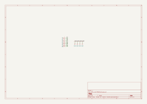
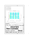

# Dry Electrodes Module
This module is responsible for interfacing the sensors/actuators inputs/outputs with the user skin or with other modules.

## Electrical Schematic

## PCB Layout

## 3D Model
