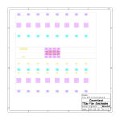

# Communication Module
This module extends the electrodes module. It a flexible PCB that connects the electrodes module and offers a flexible interface to the user.

## Electrical Schematic

## PCB Layout

## 3D Model
