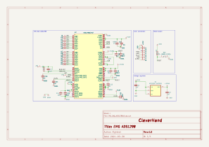

# EMG ADS1298 Module
This module is a data acquisition module that embeds the ADS1298 analog front-end. It is responsible for acquiring the EMG signals from the electrodes.

## Electrical Schematic

## PCB Layout

## 3D Model
