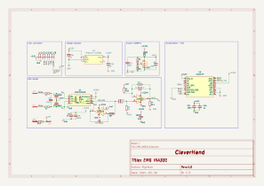

# EMG INA331 Module
This module is a data acquisition module that embeds the INA331 and a LIS3DH accelerometer. The INA331 is responsible for acquiring the EMG signals from the electrodes while the LIS3DH is responsible for acquiring the accelerometer signals and converting the EMG signals to digital signals.

## Electrical Schematic

## PCB Layout

## 3D Model
