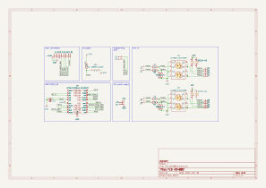

# FES AO4882 Module
This module is a electrical stimulation module that embeds 2 AO4882 MOSFETs. It is responsible for generating the electrical stimulation signals that will be sent to the electrodes. 

## Electrical Schematic

## PCB Layout

## 3D Model
