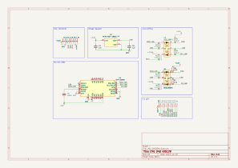

# IMU ICM2094 Module
This module is an Inertial Measurement Unit (IMU) that embeds the ICM2094 sensor. It is responsible for acquiring the acceleration, angular velocity and magnetic field signals.

## Electrical Schematic

## PCB Layout

## 3D Model
