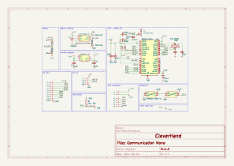
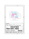

# Communication Module
This module is responsible for handling the communication between the different modules of the controller node.

The communication bus is composed of :
- Power supply (3.3V) and ground
- SPI bus (POCI, PICO, SCK)
- I2C bus (SDA, SCL)
- Address bus (A0, A1, A2, A3, A4)
- External reference voltage (AREF)

When the module is connected to the bus, it is assigned an address by the controller node. This address is used to identify the module on the bus.
The communication module will activate the chip select line of the associated sensor module when the address bus matches its address.
Additionally, each module has a unique identifier that is used to identify the module on the I2C bus.

## Electrical Schematic


## PCB Layout


## 3D Model


```stl
// MONO_CTRL_pcb.stl
