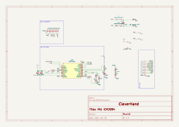

# Vibrotactile STSPIN240 Module
This module is a vibrotactile module that embeds the STSPIN240 motor driver. It is responsible for generating the vibrotactile signals that will be sent to the vibrotactile actuators.

## Electrical Schematic

## PCB Layout

## 3D Model
