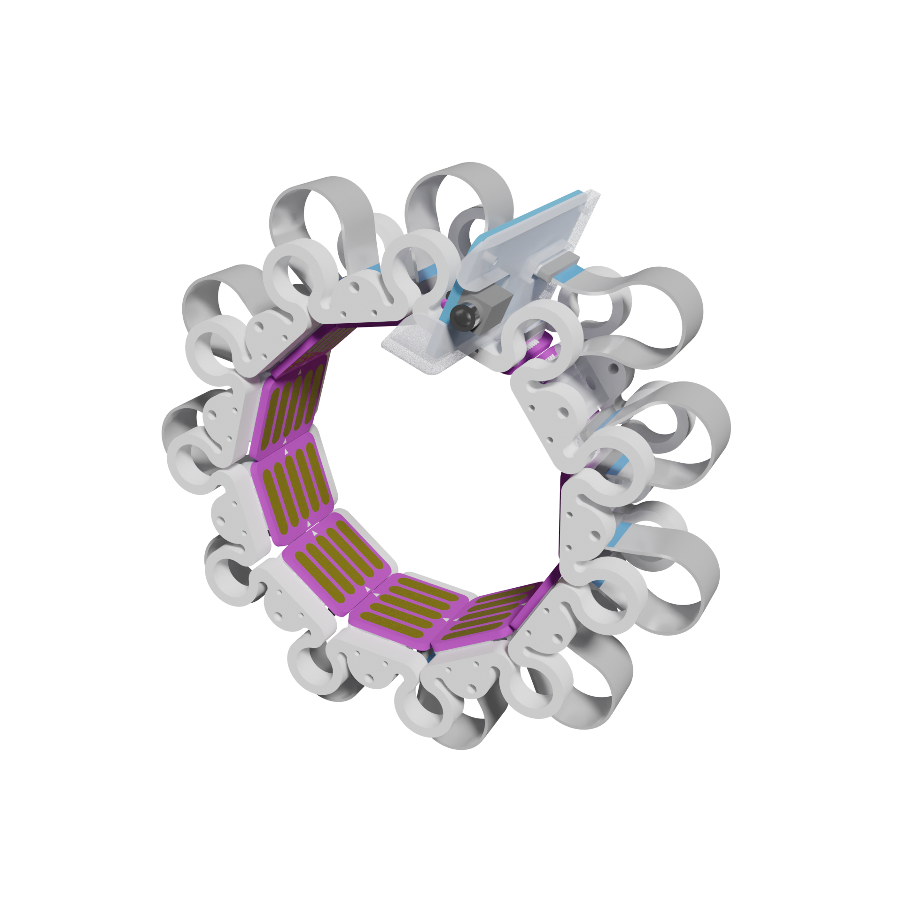
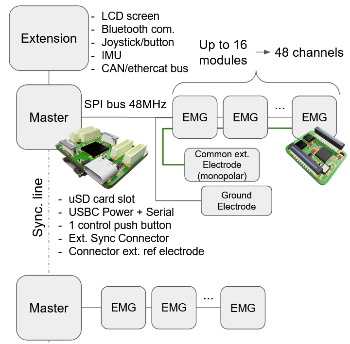
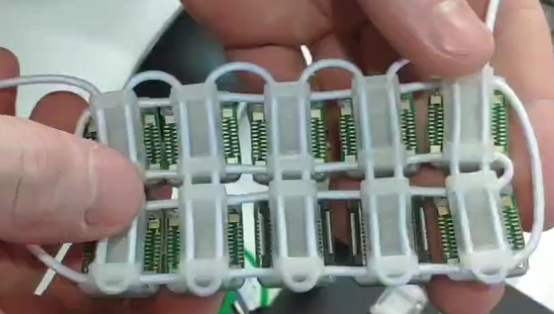
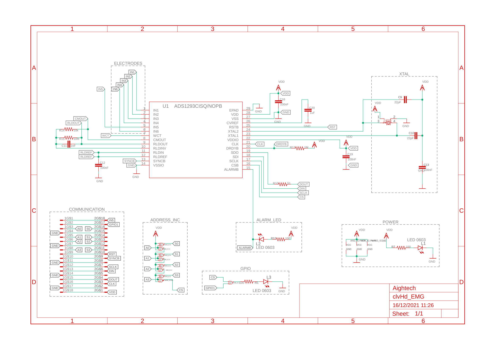
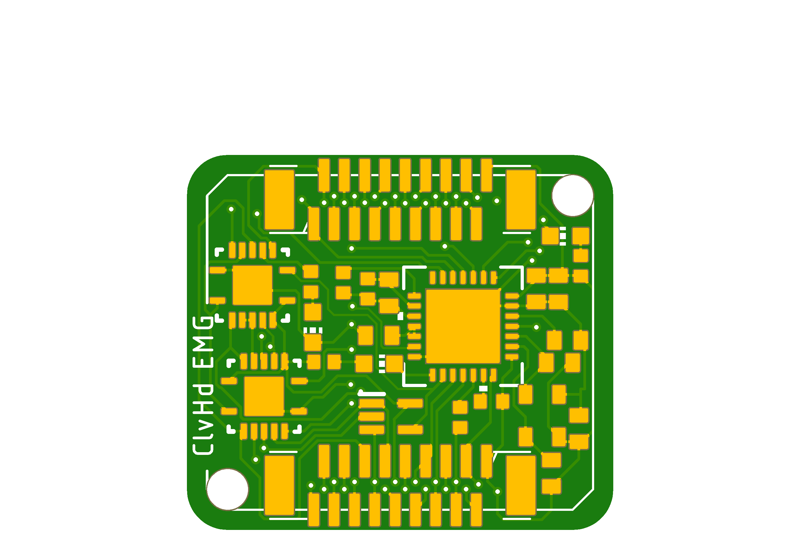
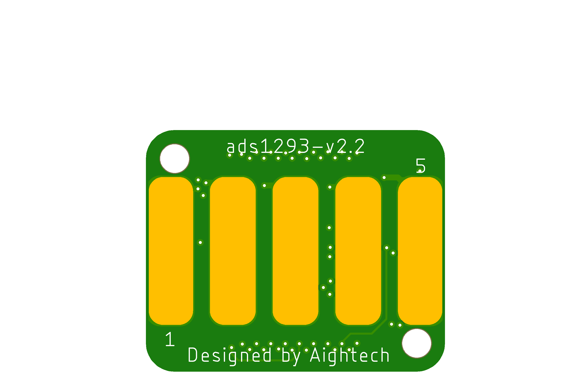
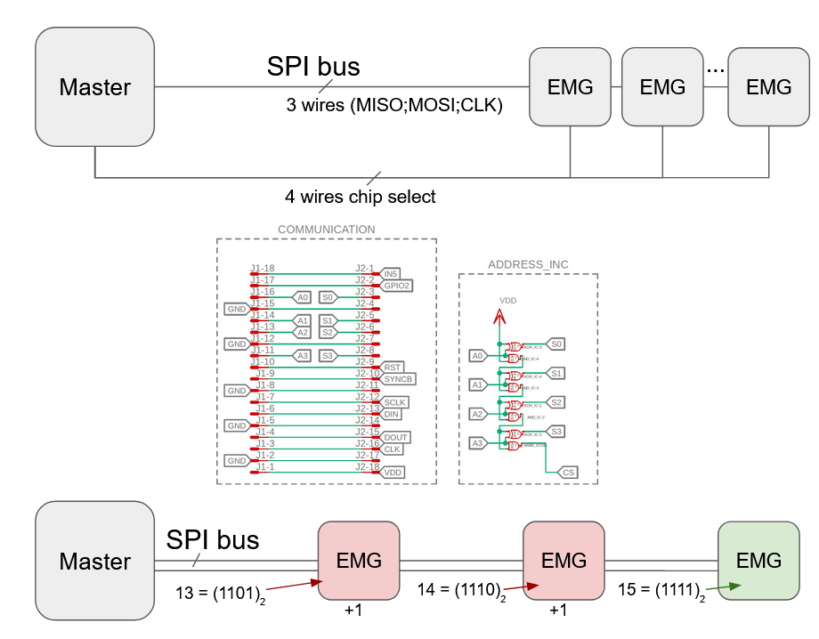

# CleverHand

## EMG Electrodes

Robotics prosthesis are highly sophisticated devices, which imply very expensive components to provide acceptable performances. Consequently, it is almost impossible to find effective hand prosthesis for less than tens of thousands euros. To tackle this issue, we are designing the "Clever Hand", a low-cost modular alternative for electromyography (EMG).

## Requirememts
| **Constraint** |Status|Comment|
:---:|:---:|:---:|
|Wearable | :hammer:| Wifi feature in progress|
|>16 channels | :heavy_check_mark:| Up to 80 channels (16x5) |
|>2kHz bandwidth|:heavy_check_mark:| Up to 2.5kHz|
|>=16 bits resolution|:heavy_check_mark:| Up to 24bits|
|Bipolar/Monopolar |:heavy_check_mark:||
|Modular | :heavy_check_mark:| 1 to 16 modules by bus|
|Affordable | :heavy_check_mark:| <15€ per modules|
|Opensource |:heavy_check_mark:||

### Other features
5 on-board electrodes
Flexible ADC-elecrodes rooting
1 shared ext. electrode
1 power LED
1 alert LED
1 interface LED

## Solution

### Structure

### Connection

### Structure

### Schmatics

## Visualisation
Top layer            |  Bottom layer
:-------------------------:|:-------------------------:
 |  

### Rendering

### Animation

## Chip select feature

