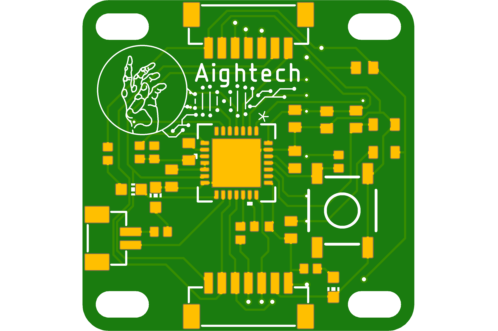

# CleverHand

## EMG Electrodes

Robotics prosthesis are highly sophisticated devices, which imply very expensive components to provide acceptable performances. Consequently, it is almost impossible to find effective hand prosthesis for less than tens of thousands euros. To tackle this issue, we are designing the "Clever Hand", a low-cost alternative for electromyography (EMG).

Top layer            |  Bottom layer
:-------------------------:|:-------------------------:
 |  

## Master

Top layer            |  Bottom layer
:-------------------------:|:-------------------------:
 |  

