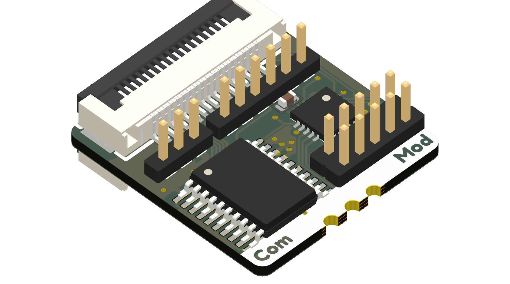
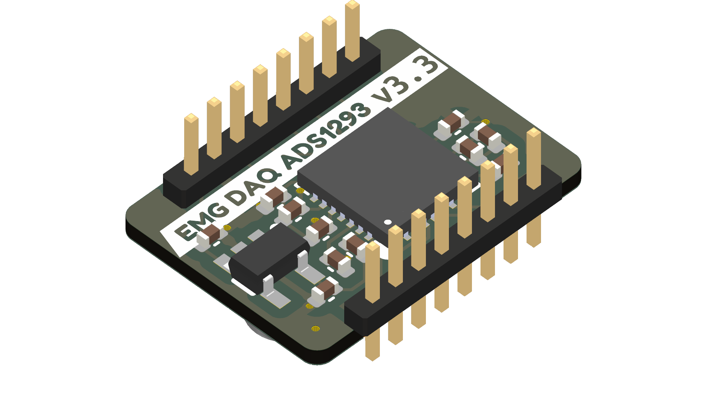
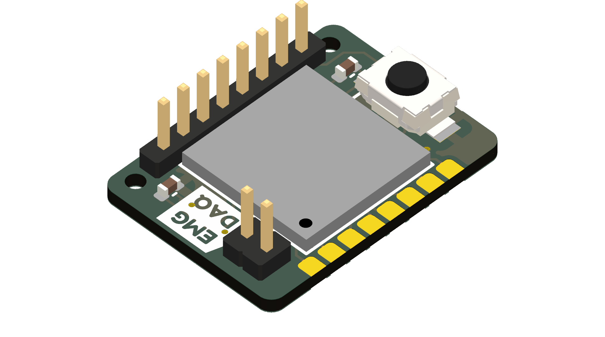
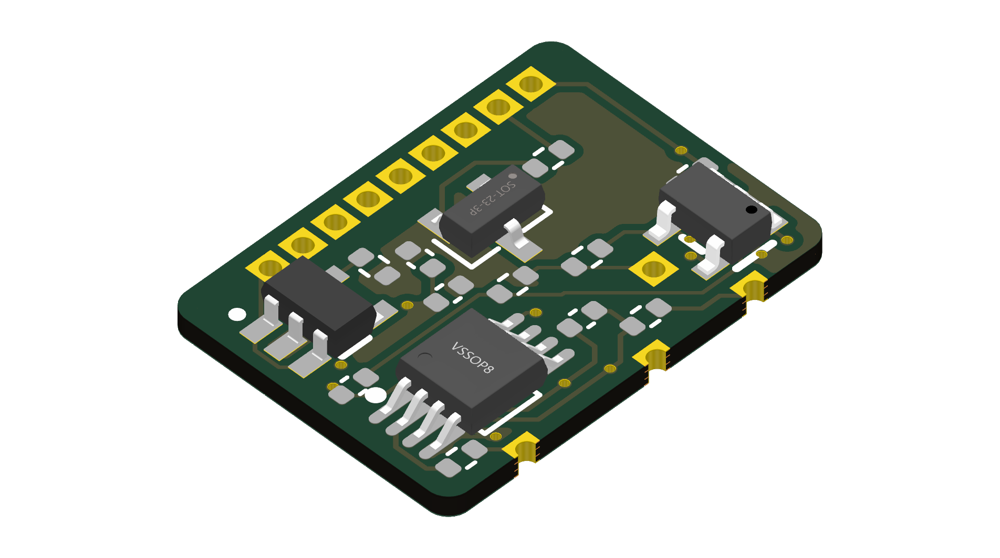
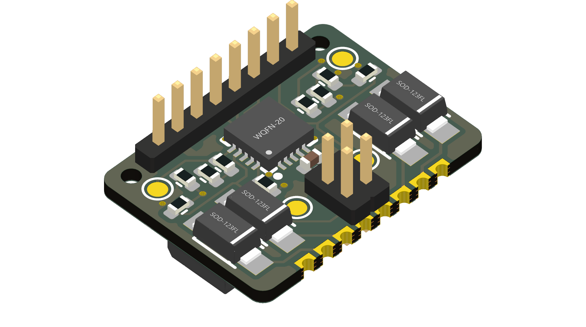
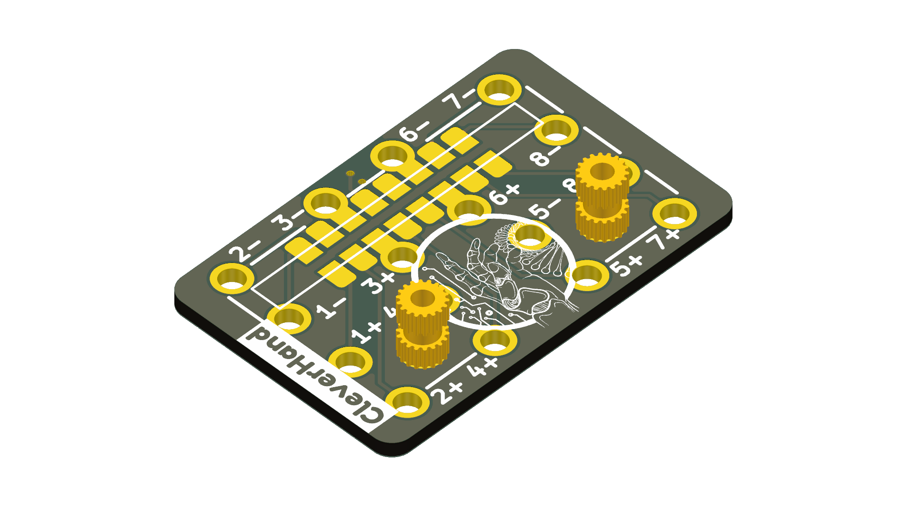
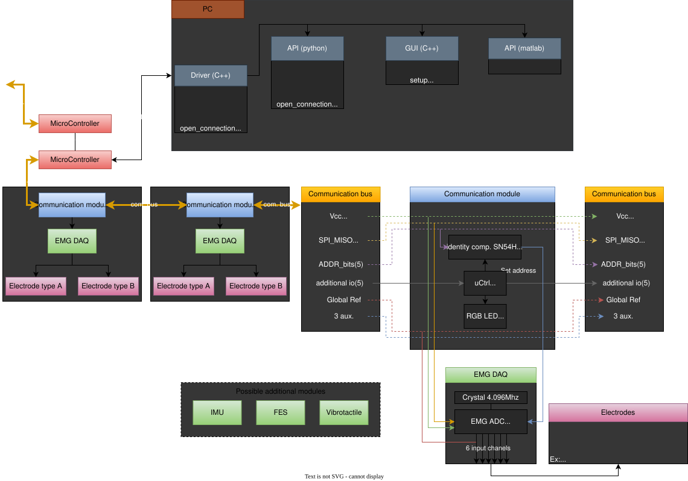
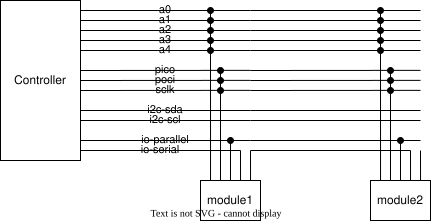

Below is a **re-aligned hardware README** that is explicitly consistent with the **top-level CleverHand README** you’ve been converging toward:

* same **vision**: open, modular HMI *platform*
* same **scope boundary**: research / education, not medical
* same **language**: platform, reference modules, readiness, QC
* avoids duplicate “marketing” claims
* hardware README = **concrete implementation of the platform**, not a separate project

I’ve kept your constraint on images and paths, and structured it so the top-level README can *point to this one* cleanly.

You can replace your current hardware README with the following.

---

# CleverHand — Hardware

This repository contains the **hardware implementation** of the CleverHand platform.

CleverHand is an open-source, modular **Human–Machine Interface (HMI) platform** designed for
research, education, and rapid prototyping in neurotechnology, robotics, and human–robot interaction.

The hardware repository provides:

* modular PCB designs (KiCad),
* mechanical integration assets,
* manufacturing outputs,
* and per-module documentation and quality metadata.

> This repository focuses **only on hardware**.
> Firmware, software, tools, and platform-level documentation live in sibling repositories.

---

## Position in the CleverHand platform

CleverHand is structured as a **hardware / firmware / software stack**:

* **Hardware** (this repo)
  Modular, chainable PCBs for sensing, actuation, and interfacing with the human body.

* **Firmware**
  Low-level drivers, bus control, synchronization, and data transport.

* **Software & SDKs**
  Host interfaces (GUI, Python, C++, LSL, ROS, etc.).

This separation allows:

* independent evolution of hardware and software,
* reproducible research setups,
* and multiple integration paths (DIY, PCBA, pre-assembled).

---

## Intended use & scope

CleverHand hardware is designed for:

* research experiments,
* educational use,
* prototyping of assistive and interactive systems.

It is **not**:

* a medical device,
* a certified clinical system,
* a consumer product.

All designs are provided **as-is**, with readiness and quality explicitly documented per module.

---

## Design goals & constraints

| Constraint          | Status | Notes                        |
| ------------------- | :----: | ---------------------------- |
| Wearable            |   ⚒️   | Wireless support in progress |
| ≥16 channels        |    ✅   | Up to 256 channels (32 × 8)  |
| ≥2 kHz bandwidth    |    ✅   | Up to 2.5 kHz                |
| ≥16-bit resolution  |    ✅   | Up to 24-bit                 |
| Bipolar / monopolar |    ✅   | Module-dependent             |
| Modular             |    ✅   | 1–32 modules per bus         |
| Affordable          |    ✅   | ~£10–£30 per module          |
| Open-source         |    ✅   | Hardware, firmware, software |

---

## Hardware architecture overview

The hardware platform is built around a **chainable modular architecture**.

Each CleverHand system is composed of:

* a **controller** (host interface and timing),
* one **communication module** (bus arbitration),
* one or more **HMI modules**, assembled from submodules.

### Submodule types

HMI nodes are built by stacking standardized submodules:

* **Communication submodule**
  Address decoding, bus routing, chip-select handling.

* **Sensor submodule**
  Biosignal or motion acquisition (EMG, IMU, etc.).

* **Feedback submodule**
  User feedback (vibration, electrotactile stimulation, LEDs).

* **Interface submodule**
  Physical interface to the body (dry electrodes, jack, flex PCB).

This structure allows:

* rapid reconfiguration,
* high channel density,
* reuse of validated building blocks.

---

## Module catalog (hardware)

> The table below lists **implemented hardware designs**.
> Readiness (prototype / reference) and quality status are tracked via
> `description.yaml`, QC artifacts, and the generated catalog — not inferred from this table.

| Module                  | Description                            | Image                                                                      | Documentation                                            |
| ----------------------- | -------------------------------------- | -------------------------------------------------------------------------- | -------------------------------------------------------- |
| Communication (COM_MOD) | Bus communication and address decoding |                     | [README](pcb/hmi/communication/COM_MOD/README.md)            |
| EMG ADS1293             | 5-channel EMG acquisition              |  | [README](pcb/hmi/submodule/sensor/EMG_DAQ_ADS1293/README.md) |
| EMG ADS1298             | 8-channel EMG acquisition              |  | [README](pcb/hmi/submodule/sensor/EMG_DAQ_ADS1298/README.md) |
| EMG INA331              | Single-channel EMG + IMU               |            | [README](pcb/hmi/submodule/sensor/EMG_INA331/README.md)      |
| FES AO4882              | Electrotactile stimulation             |          | [README](pcb/hmi/submodule/feedback/FES_AO4882/README.md)    |
| IMU ICM-20948           | 9-axis IMU                             |        | [README](pcb/hmi/submodule/sensor/IMU_ICM20948/README.md)    |
| Dry electrodes (16ch)   | Rigid dry electrode interface          |             | [README](pcb/hmi/interface/DRY_ELEC_16CH/README.md)          |

---

## Bus architecture

CleverHand uses a **shared bus architecture** combining:

* a 5-bit address bus,
* SPI for high-rate data transfer,
* I²C for identification and configuration.

Each communication module:

* monitors the address bus,
* activates the chip-select of the targeted submodule,
* routes SPI transactions accordingly.



---

## Addressing & initialization

Module addressing is determined during an initialization phase based on
**physical position in the chain**.

Current status:

* deterministic addressing: **implemented**
* dynamic hot-plugging: **not yet supported**

Future work will refine:

* formal initialization protocol documentation,
* dynamic re-enumeration strategies.



---

## Evaluation, QC & readiness

Hardware quality and maturity are **explicitly tracked**, not implied.

For each module:

* readiness level is declared in `description.yaml`,
* QC profiles and reports live in the module’s `qc/` folder,
* catalog readiness is generated automatically.

Only **REFERENCE-level modules** are considered stable and suitable
for external reuse without direct support.

---

## Repository structure

This repository contains the hardware designs and supporting assets for the CleverHand platform.

```
├── docs
│   ├── datasheet
│   ├── img
│   ├── initialisation
│   └── plots
├── LICENSE
├── pcb
│   ├── config_file
│   ├── controller
│   ├── hmi
│   └── tool
├── README.md
└── scripts
```

Each top-level directory has a clear, non-overlapping responsibility, described below.

---

## Relation to other repositories

* Firmware: see top-level CleverHand firmware repository
* Software / SDKs: see CleverHand interface repository
* Platform roadmap and policies: see top-level CleverHand README

---

## Status

The CleverHand hardware platform is **actively evolving**.

Some modules are experimental; others are approaching reference quality.
Authoritative status is always given by:

* module metadata,
* QC artifacts,
* and the generated catalog.
