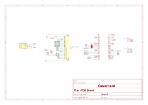

# pico shield
This shield is made to connect a pico board from seeed studio to the CleverHand bus and control the hmi modules.

## Electrical Schematic

## PCB Layout
|top view|side view|
|---|---|
|  |  |

## 3D Model
[S_PICO_3D](plots/S_PICO_pcb.stl)