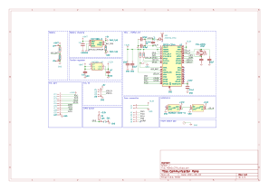

# Standalone mono-module controller
 This module is a standalone controller node that can be used to control a single submodule. It enanble standalone hmi module without the need for a cleverhand bus.

## Electrical Schematic

## PCB Layout
|top view|side view|
|---|---|
 |  |  |

## 3D Model
[MONO_CTRL_3D](plots/MONO_CTRL_pcb.stl)

