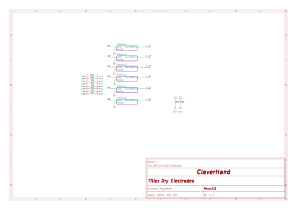
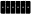

# Dry Electrodes Module
This module is responsible for interfacing the sensors/actuators inputs/outputs with the user skin or with other modules.

## Electrical Schematic

## PCB Layout
|top view|side view|
|---|---|
|||

## 3D Model
[DRY_ELEC_6CH_3D](plots/DRY_ELEC_6CH_pcb.stl)