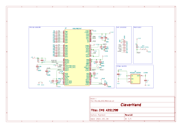

# EMG ADS1298 Module
This module is a data acquisition module that embeds the ADS1298 analog front-end. It is responsible for acquiring the EMG signals from the electrodes.

## Electrical Schematic

## PCB Layout
|top view|side view|
|---|---|
 |  |  |

## 3D Model
[EMG_DAQ_ADS1298_3D](plots/EMG_DAQ_ADS1298_pcb.stl)