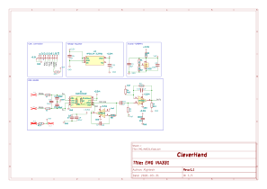

# EMG INA331 Module
This module is a data acquisition module that embeds the INA331. The INA331 is responsible for acquiring the EMG signals from the electrodes. The shematic design is from seeed studio grove module. This module can be used only with a ADC compatible com module.

## Electrical Schematic

## PCB Layout
|top view|side view|
|---|---|
 |  |  |

## 3D Model
[EMG_INA331_3D](plots/EMG_INA331_pcb.stl)