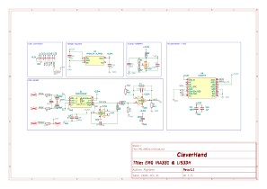

# EMG INA331 LIS Module
This module is a data acquisition module that embeds the INA331 and a LIS3DH accelerometer. The INA331 is responsible for acquiring the EMG signals from the electrodes while the LIS3DH provides the accelerometer signals. This module can be used only with a ADC compatible com module.

## Electrical Schematic

## PCB Layout
|top view|side view|
|---|---|
 |  |  |

## 3D Model
[EMG_INA331_LIS_3D](plots/EMG_INA331_LIS.stl)
