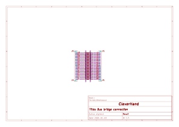
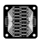
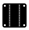

# Bus Connection
This module is a passive bridge to easily access the cleverhand bus tracks.

## Electrical Schematic

## PCB Layout
| top | bottom |
| --- | --- |
| |  |

## 3D Model
[BUS_CONN_3D](plots/BUS_CONN_pcb.stl)