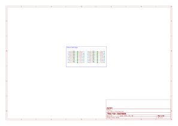
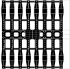
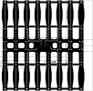

# Flex Interface Module
This module extends the electrodes module. It a flexible PCB that connects the electrodes module and offers a flexible interface to the user.

## Electrical Schematic

## PCB Layout
|top view|side view|
|---|---|
|||

## 3D Model
[DRY_FLEX_3D](plots/DRY_FLEX_pcb.stl)