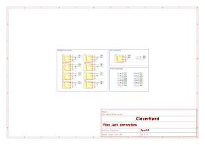
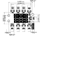
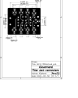

# Jack Connection
 This extension board let you connect a hmi module (with a 4x4 dry interface) to jack connector. 

## Electrical Schematic

## PCB Layout
|top view|side view|
|---|---|
 |  |  |

## 3D Model
[JACK_CONN_3D](plots/JACK_CONN_pcb.stl)