# Features description

- ADS1293 (3-channel simultaneous sampling, 6 inputs,  24-bit, 8-ksps, 4-uA, delta-sigma ADCs)
- HC32L110 (ARM Cortex-M0+, 32MHz, 32KB Flash, 4KB SRAM)
- Logic addressing (4bits Chip Select) non-fixed address (based on the physical position in the chain)
- Up to 16 modules in the chain:
    - each module contains 3 channels
        - each channel is sampled on 3 bytes (24 bits)
- Request (PC to uCtrl) 1 bytes @480Mbits/s: 17ns
- 16 Requests-response 
    - request (uCtrl to ADSs): Select ADS: 50ns + 1 byte @1Mbits/s: 8us
    - response (ADSs to uCtrl): 3*3 bytes @1Mbps: 72us
    ==> 16 * (50ns + 8us + 72us) = 16 * 80us = 1.3ms
- Response (uCtrl to PC) 16*9 bytes @480Mbits/s: 2.3us
==> 39ns + 1.3s + 2.3us = 1.4ms ==> sampling rate = 700Hz

```mermaid
sequenceDiagram
    participant PC
    participant uCtrl as Teensy
    participant ADSs as Module[1-16]

    PC->>uCtrl: Request 
    Note over PC,uCtrl: 1 bytes@480Mbits/s: 17ns

    loop For Each of 16 Modules
        uCtrl->>ADSs: Select module
        Note over uCtrl,ADSs: 50ns
        
        uCtrl->>ADSs: Request 
        Note over uCtrl,ADSs: 1 byte@1Mbits/s: 8us

        ADSs->>uCtrl: Response (3 channels x 3 bytes)
        Note over ADSs,uCtrl: 9 bytes@1Mbits/s: 72us
    end
    Note over ADSs,uCtrl: 9 bytes@1Mbits/s: 1.3ms



    uCtrl->>PC: Response (48 channels) 
    Note over uCtrl,PC: 144 bytes@480Mbits/s: 2.3us

    Note over PC: Total Time: 516us<br/>Sampling Rate ≈ 700Hz

```

